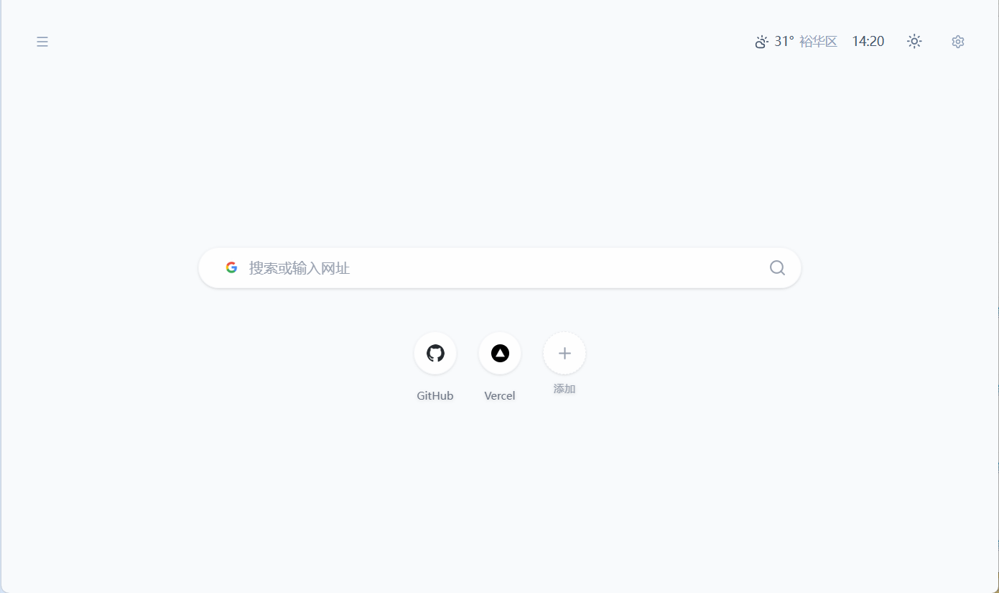

# Miuo Nav

> [中文文档](README.md)



A polished, minimalist browser start page / dashboard.

- Multi-engine search (Google, DuckDuckGo, Bing, Baidu, GitHub)
- Bookmarks with drag-reorder, categories, edit/delete, WebDAV cloud sync
- Real-time clock + weather (Amap API, auto-detect city/district)
- Dark/light theme, i18n (中文 / English), background image
- Sidebar with accordion category groups
- All data in localStorage (export/import with full settings)

## Features

| Feature | Description |
|---------|-------------|
| **Search** | Ctrl+K focus, 5 search engines, favicon indicators |
| **Bookmarks** | Pin to homepage, right-click edit/delete, drag to reorder |
| **Categories** | Group bookmarks, accordion sidebar |
| **Weather** | Amap API, browser geolocation + IP fallback, district-level |
| **Background** | Bing daily / custom URL / local upload |
| **WebDAV Sync** | Push/pull to any WebDAV server (full config included) |
| **i18n** | Auto-detect browser language, switch in settings |
| **Theme** | Light/dark toggle |
| **Import/Export** | JSON file with drag-and-drop, includes all settings |

## Deploy to Vercel

1. Push to GitHub
2. Go to [vercel.com](https://vercel.com) → Add New Project
3. Import `miuo-nav` repo
4. **Build Command**: `pnpm build`
5. **Output Directory**: `dist`
6. Click **Deploy**

The app is fully static, so it also works with Cloudflare Pages, Netlify, or any static host.

## API Configuration

### Weather

Uses [Amap (高德地图) Weather API](https://lbs.amap.com/api/webservice/guide/api/weatherinfo).

1. Go to [高德开放平台](https://lbs.amap.com/) → 应用管理 → 创建应用 → 添加 Key (Web 服务)
2. In Settings → Preferences → enable Weather → fill in **API Key**
3. Click **Auto Detect** → browser geolocation with IP fallback, down to district level
4. If inaccurate, search manually by city or district name (e.g. "裕华区")

The API is proxied through Vite (dev) or Vercel rewrites (production) — no CORS config needed.

### Background Bing Daily

Uses a public proxy `bing.biturl.top` that redirects to Bing's image of the day. No API key needed. If the proxy is unreachable, switch to "Custom URL" in settings.

### WebDAV

| Field | Value |
|-------|-------|
| Server URL | `https://dav.example.com` |
| Username | Your WebDAV username |
| Password | Your WebDAV password |

Synced as `miuo_nav_config.json`, includes bookmarks, weather, background, theme, language.

Recommended WebDAV providers:

**Nutstore (坚果云)** — free, China-friendly
| Field | Value |
|-------|-------|
| Server URL | `https://dav.jianguoyun.com/dav/` |
| Username | Your Nutstore email |
| Password | App password (Nutstore → Account → Security → Generate App Password) |


## Tech Stack

- **Vite** + **React 19** + **TypeScript**
- **Tailwind CSS v4** (class-based dark mode)
- **shadcn/ui** (Radix primitives)
- **i18next** + **react-i18next**
- **webdav** (frontend WebDAV client)

## Local Development

```
pnpm install
pnpm dev      # http://localhost:5173
pnpm build    # outputs to dist/
```
